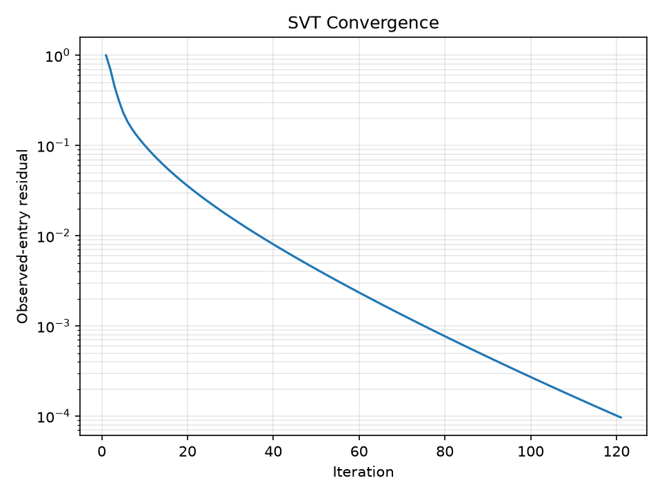

# Movie Recommendation System

An implementation of **Singular Value Thresholding (SVT)** for **matrix completion**, using movie recommendation as the motivating application.

---

## Problem

Let $M\in\mathbb{R}^{m\times n}$ be a user-movie ratings matrix. Rows represent users, columns represent movies, and only a subset of ratings is observed.

Let $\Omega=\{(i,j):M_{ij}\text{ is observed}\}$. Define the sampling operator

```math
P_\Omega(X)_{ij}
=
\begin{cases}
X_{ij},&(i,j)\in\Omega,\\
0,&(i,j)\notin\Omega.
\end{cases}
```

The goal of **matrix completion** is to recover a matrix $X$ satisfying $P_\Omega(X)=P_\Omega(M)$.

Once $X$ is recovered, unseen movies can be ranked using their predicted ratings.

---

## Why Low Rank?

User ratings are correlated. A relatively small number of latent factors can explain much of the variation in user preferences.

A rank- $r$ matrix has the SVD $M=U\Sigma V^T$, where $U\in\mathbb{R}^{m\times r}$, $\Sigma\in\mathbb{R}^{r\times r}$, and $V\in\mathbb{R}^{n\times r}$, with $r\ll\min(m,n)$.

Equivalently,

```math
M=\sum_{i=1}^{r}\sigma_i u_i v_i^T.
```

Thus a low-rank matrix is composed of a small number of rank-one components.

This motivates the ideal recovery problem:

```math
\boxed{
\min_X\;\mathrm{rank}(X)
\quad\mathrm{s.t.}\quad
P_\Omega(X)=P_\Omega(M).
}
```

Rank minimization is non-convex and computationally difficult. A standard convex relaxation replaces rank with the **nuclear norm** $\lVert X\rVert_*=\sum_i\sigma_i(X)$:

```math
\boxed{
\min_X\;\|X\|_*
\quad\mathrm{s.t.}\quad
P_\Omega(X)=P_\Omega(M).
}
```

The nuclear norm plays a role for low-rank matrices analogous to the $\ell_1$ norm for sparse vectors.

---

## SVT Formulation

SVT solves the regularized problem

```math
\boxed{
\min_X\;
\tau\lVert X\rVert_*+\frac12\lVert X\rVert_F^2
\quad\mathrm{s.t.}\quad
P_\Omega(X)=P_\Omega(M).
}
```

The additional Frobenius-norm term makes the objective strongly convex and gives the problem a unique solution, while still keeping it closely related to the original nuclear-norm formulation.

For a sufficiently large $\tau$, the solution of the regularized problem approaches the solution of the nuclear-norm minimization problem

```math
\boxed{
\min_X\;\lVert X\rVert_*
\quad\mathrm{s.t.}\quad
P_\Omega(X)=P_\Omega(M).
}
```

Thus, $\tau$ controls the trade-off introduced by the regularization: increasing $\tau$ makes the regularized problem increasingly close to the original nuclear-norm problem.

Let $b=P_\Omega(M)$. The constraint is $P_\Omega(X)=b$.

Introduce a matrix-valued Lagrange multiplier $Y$ and define the **Lagrangian**

```math
L(X,Y)
=
\tau\lVert X\rVert_*
+
\frac12\lVert X\rVert_F^2
+
\langle Y,b-P_\Omega(X)\rangle_F.
```

The Frobenius inner product is $\langle A,B\rangle_F=\mathrm{Tr}(A^TB)=\sum_{i,j}A_{ij}B_{ij}$.

For fixed $Y$, minimizing the Lagrangian over $X$ gives the **dual function**

```math
g(Y)=\inf_X L(X,Y).
```

The corresponding dual problem is

```math
\boxed{
\max_Y g(Y).
}
```

Thus, SVT alternates between minimizing over the primal variable $X$ and maximizing over the dual variable $Y$.

---

## Dual Gradient Ascent

Gradient ascent on the dual gives

```math
Y^k
=
Y^{k-1}
+
\delta_k\nabla g(Y^{k-1}),
```

where $\delta_k>0$ is the step size.

The dual gradient is $\nabla g(Y^{k-1})=b-P_\Omega(X^k)=P_\Omega(M-X^k)$, so

```math
\boxed{
Y^k
=
Y^{k-1}
+
\delta_kP_\Omega(M-X^k).
}
```

The term $P_\Omega(M-X^k)$ is the error on the observed entries. Thus the dual update increases the pressure to satisfy the known ratings.

Since $Y^0=0$ and every update is supported only on $\Omega$, we have $Y^k=P_\Omega(Y^k)$.

---

## Singular Value Thresholding

For fixed $Y$, the corresponding primal variable is obtained by minimizing the Lagrangian over $X$.

Starting from

```math
L(X,Y)
=
\tau\lVert X\rVert_*
+
\frac12\lVert X\rVert_F^2
+
\langle Y,b-P_\Omega(X)\rangle_F,
```

the term $\langle Y,b\rangle_F$ is constant with respect to $X$, so it can be ignored.

Since $Y^k=P_\Omega(Y^k)$, we have

```math
\langle Y,P_\Omega(X)\rangle_F
=
\langle Y,X\rangle_F.
```

Therefore,

```math
\begin{aligned}
\min_X L(X,Y)
&\equiv
\min_X
\left\{
\tau\lVert X\rVert_*
+
\frac12\lVert X\rVert_F^2
-
\langle Y,X\rangle_F
\right\}\\
&=
\min_X
\left\{
\tau\lVert X\rVert_*
+
\frac12\lVert X-Y\rVert_F^2
-
\frac12\lVert Y\rVert_F^2
\right\}.
\end{aligned}
```

The last term is constant with respect to $X$, so

```math
\boxed{
X^k
=
\arg\min_X
\left\{
\tau\lVert X\rVert_*
+
\frac12\lVert X-Y^{k-1}\rVert_F^2
\right\}.
}
```

This is the **proximal operator of the nuclear norm**:

```math
X^k
=
\mathrm{prox}_{\tau\lVert\cdot\rVert_*}(Y^{k-1}).
```

The key result is that this proximal operator is exactly **singular-value thresholding**.

If $Y^{k-1}=U\Sigma V^T$, then

```math
\boxed{
D_\tau(Y^{k-1})
=
U(\Sigma-\tau I)_+V^T.
}
```

where $(\sigma_i-\tau)_+=\max(\sigma_i-\tau,0)$.

Therefore, each singular value is transformed as

```math
\sigma_i
\longmapsto
(\sigma_i-\tau)_+.
```

Small singular values are set to zero, while larger singular values are shrunk. This promotes a low-rank solution.

For example,

```math
D_3
\left(
\begin{bmatrix}
5&0\\
0&2
\end{bmatrix}
\right)
=
\begin{bmatrix}
2&0\\
0&0
\end{bmatrix}.
```

The complete SVT iteration is

```math
\boxed{
X^k=D_\tau(Y^{k-1}),
\qquad
Y^k=Y^{k-1}+\delta_kP_\Omega(M-X^k).
}
```

The two steps have complementary roles:

```math
\underbrace{X^k=D_\tau(Y^{k-1})}_{\text{promote low rank}}
\qquad
\underbrace{
Y^k=Y^{k-1}+\delta_kP_\Omega(M-X^k)
}_{\text{enforce observed entries}}.
```

---

## Implementation

The implementation follows the main large-scale ideas of the original SVT algorithm:

- **Sparse $Y$:** only observed entries are updated, so $Y$ remains sparse.
- **Reduced SVD:** $X$ is represented using the singular vectors and singular values that survive thresholding.
- **Partial SVD:** only singular values above the threshold are needed, avoiding a full SVD of the matrix.
- **Initial zero iterations:** iterations that would produce an all-zero estimate can be skipped.
- **Paper-inspired parameters:** the synthetic experiment uses Gaussian low-rank factors, $\tau=5n$, and an oversampling ratio of 6.

---

## Experiment

The experiment uses a synthetic low-rank matrix so that the ground truth is known and reconstruction error can be measured directly.

Run:

```powershell
python experiment.py --size 1000 --rank 10 --oversampling-ratio 6
```

The experiment records convergence metrics and writes them to:

```text
artifacts/experiment.json
```

### Example Result

For a $1000\times1000$ rank-10 synthetic matrix with an oversampling ratio of 6, one run produced:

- **Iterations:** 121
- **Recovered rank:** 10
- **Relative reconstruction error:** approximately $1.70\times10^{-4}$

The exact result can vary because the synthetic matrix is randomly generated.

---

## Convergence

For a representative synthetic matrix-completion instance, the observed-entry residual decreases steadily over the SVT iterations.



---

## Testing

Run:

```powershell
python test_svt.py
```

The tests check two main properties.

### 1. Singular-value thresholding

For 

```math
Y =
\begin{bmatrix}
5 & 0 \\
0 & 2
\end{bmatrix}
```

and $\tau=3$,

```math
D_3(Y)
=
\begin{bmatrix}
2&0\\
0&0
\end{bmatrix}.
```

This verifies the core SVT operation.

### 2. Matrix recovery

A small rank-2 matrix is generated, a subset of its entries is hidden, and SVT is used to reconstruct it.

The test checks both the observed-entry residual

```math
\frac{\|P_\Omega(X-M)\|_F}{\|P_\Omega(M)\|_F}
```

and the relative reconstruction error.

Because the test matrix is generated internally, its ground truth is available.

---

## Applying It to MovieLens

The solver can be applied to MovieLens or another ratings dataset by constructing:

1. a user-by-movie ratings matrix;
2. a mask identifying observed ratings.

Then call `complete` from `svt.py`.

For a meaningful recommender evaluation, known ratings should first be split into **training** and **held-out** sets.

SVT is run only on the training observations, and predictions are evaluated on the held-out ratings.

Two standard metrics are:

```math
\mathrm{RMSE}
=
\sqrt{
\frac1N
\sum_{k=1}^{N}
(\hat r_k-r_k)^2
}
```

and

```math
\mathrm{MAE}
=
\frac1N
\sum_{k=1}^{N}
|\hat r_k-r_k|.
```

Evaluating only on the ratings used for completion would measure reconstruction of the training data rather than prediction of unseen ratings.

---

## Installation

Clone the repository and run the setup script:

```powershell
git clone https://github.com/TTSurya/Movie-Recommendation-System.git
cd Movie-Recommendation-System
.\setup.ps1
```

---

## Run

### Tests

```powershell
python test_svt.py
```

### Synthetic experiment

```powershell
python experiment.py --size 1000 --rank 10 --oversampling-ratio 6
```

Results are written to:

```text
artifacts/experiment.json
```

### Convergence plot

```powershell
python plot.py
```

The convergence plot is saved to 

```text
artifacts/convergence.png
```

---

## Mathematical Summary

The regularized matrix-completion problem is

```math
\boxed{
\min_X\;
\tau\|X\|_*+\frac12\|X\|_F^2
\quad\mathrm{s.t.}\quad
P_\Omega(X)=P_\Omega(M)
}
```

The dual update is

```math
\boxed{
Y^k
=
Y^{k-1}
+
\delta_kP_\Omega(M-X^k).
}
```

The primal update is

```math
\boxed{
X^k
=
D_\tau(Y^{k-1}).
}
```

For $Y^{k-1}=U\Sigma V^T$, singular-value thresholding is

```math
\boxed{
D_\tau(Y^{k-1})
=
U(\Sigma-\tau I)_+V^T.
}
```

Thus the algorithm can be summarized as

```math
\boxed{
\text{matrix completion}
\;\Longrightarrow\;
\text{low-rank assumption}
\;\Longrightarrow\;
\text{nuclear-norm relaxation}
\;\Longrightarrow\;
\text{dual gradient ascent}
\;\Longrightarrow\;
\text{proximal minimization}
\;\Longrightarrow\;
\text{singular-value thresholding}.
}
```

---

## Reference

J.-F. Cai, E. J. Candès, and Z. Shen, A Singular Value Thresholding Algorithm for Matrix Completion, SIAM Journal on Optimization, 20(4), 1956–1982, 2010.
